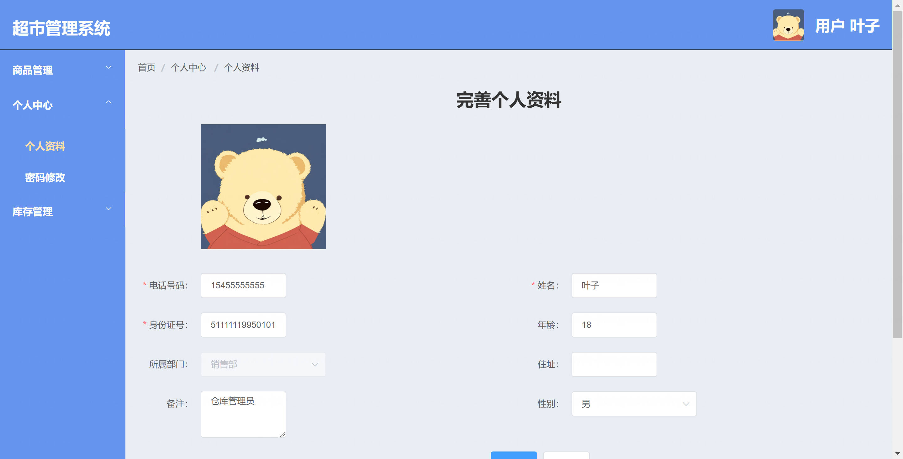
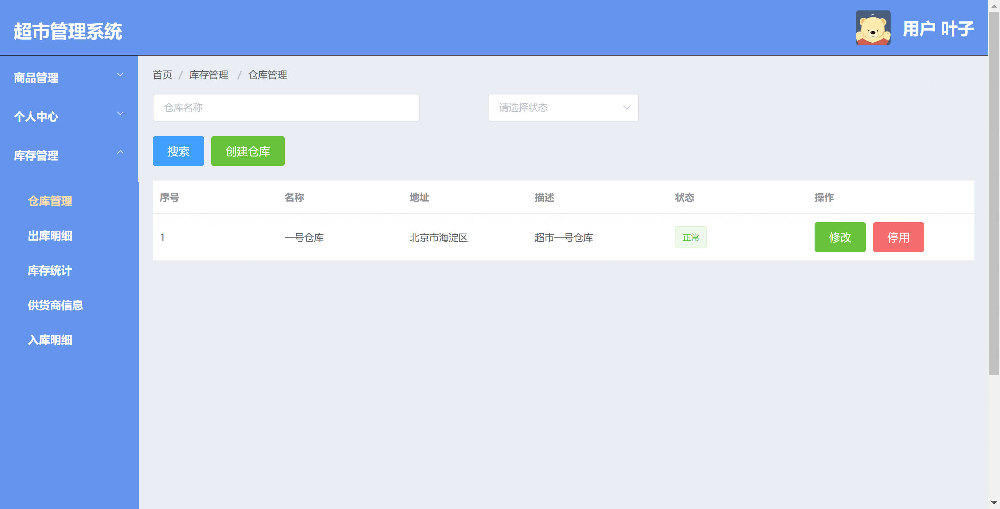
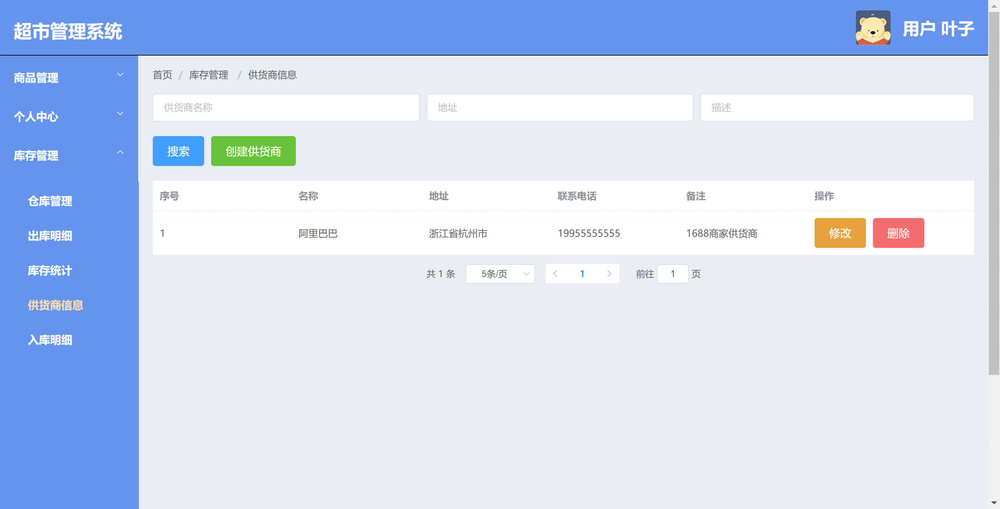
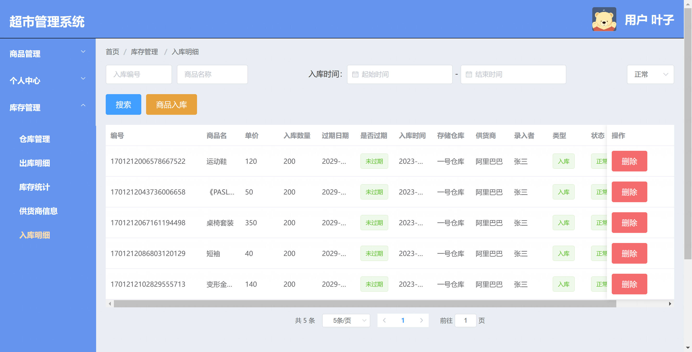
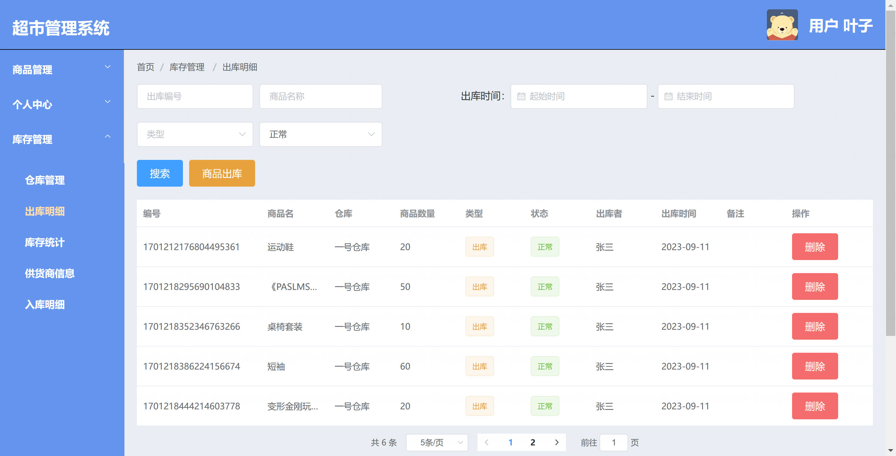
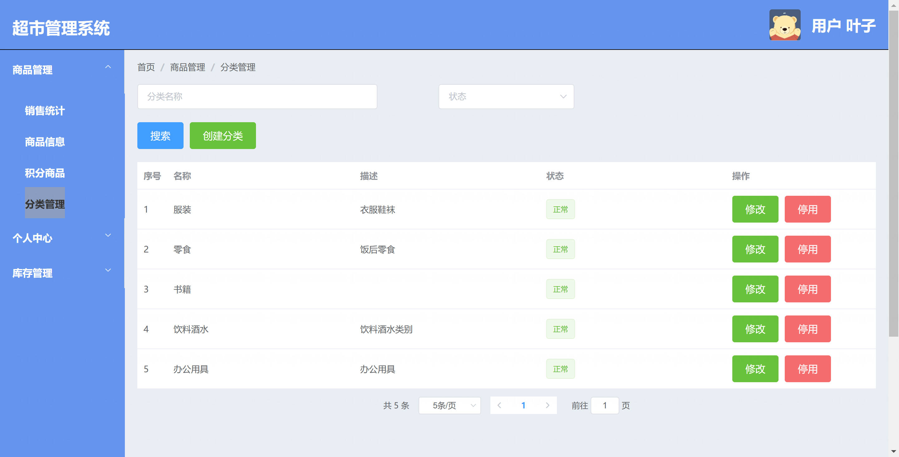
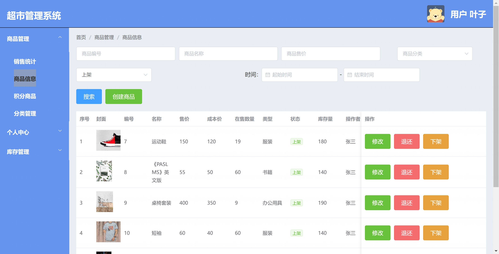
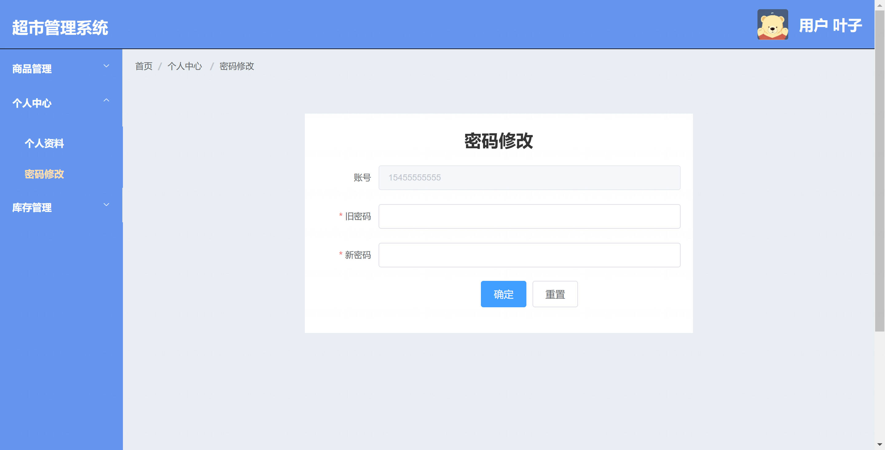
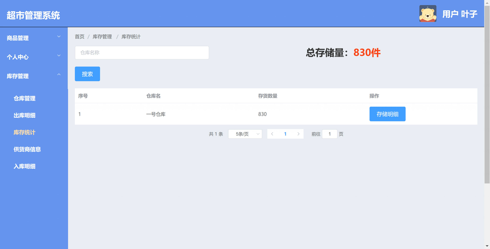
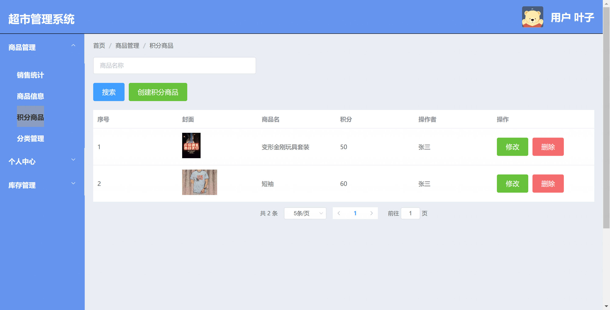

基于 Spring Boot 的超市管理系统
=

### 完整代码获取地址：从戎源码网 ([https://armycodes.com/](https://armycodes.com/))
### 作者微信：19941326836  QQ：952045282 
### 承接计算机毕业设计、Java毕业设计、Python毕业设计、深度学习、机器学习
### 选题+开题报告+任务书+程序定制+安装调试+论文+答辩ppt 一条龙服务
### 所有选题地址https://github.com/nature924/allProject

一、项目介绍
---

基于 Spring Boot + Vue 的超市管理系统，系统角色包括：系统管理员、收银员、仓库管理员、用户等，主要功能如下
超级管理员：
基本操作：登录、修改密码、获取/修改个人信息
系统管理：员工管理（增删改查、按部门管理）、部门管理、角色管理（新增/删除/分配权限/查看权限）、菜单管理
权限与日志：权限分配（基于角色的权限控制）、查看/筛选系统日志
商品管理：商品分类管理、商品信息增删改查、商品图片上传（阿里云 OSS）、商品上下架
库存管理：仓库/门店管理、供应商管理、库存明细查询、入库/出库记录管理
销售管理：创建销售单（收银）、销售记录查询、销售明细、退货处理
会员与积分：会员管理（增删改查、按电话查询）、积分管理、积分商品管理、积分兑换记录管理
公告/个人中心：发布/查看公告、个人信息查看/修改
报表统计：销售统计、商品销售排行等报表

收银员：
基本操作：登录、修改密码、获取/修改个人信息
收银业务：创建销售单、快速查询商品、使用会员信息结算/积分抵扣
销售记录：查看当日/历史销售记录及明细、处理退货
会员查询：按手机号查询会员并使用会员积分

仓库管理员：
基本操作：登录、修改密码、获取/修改个人信息
仓库业务：仓库/门店管理、供应商管理、库存明细维护
库存操作：入库登记、出库登记、库存调整、查看库存记录

二、项目技术
---
- 编程语言：Java
- 数据库：MySQL
- 项目管理工具：Maven
- 前端技术：VUE、HTML、Jquery、Bootstrap
- 后端技术：Spring、SpringMVC、MyBatis

三、运行环境
---
- 操作系统：Windows、macOS都可以
- JDK版本：JDK1.8以上都可以
- 开发工具：IDEA、Ecplise、Myecplise都可以
- 数据库: MySQL5.7以上都可以
- Tomcat：任意版本都可以
- Maven：任意版本都可以

四、运行截图
---
### 程序截图：

